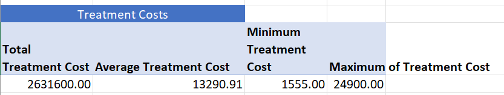
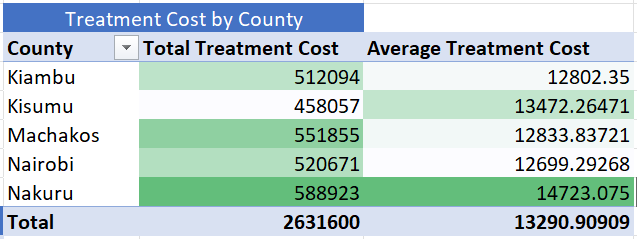
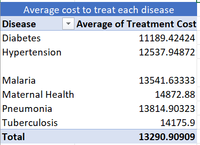
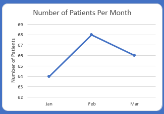
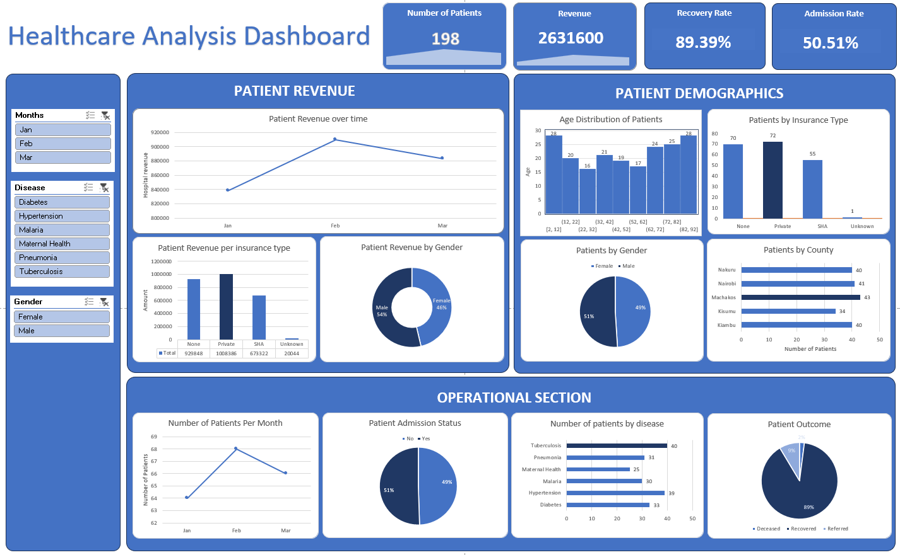
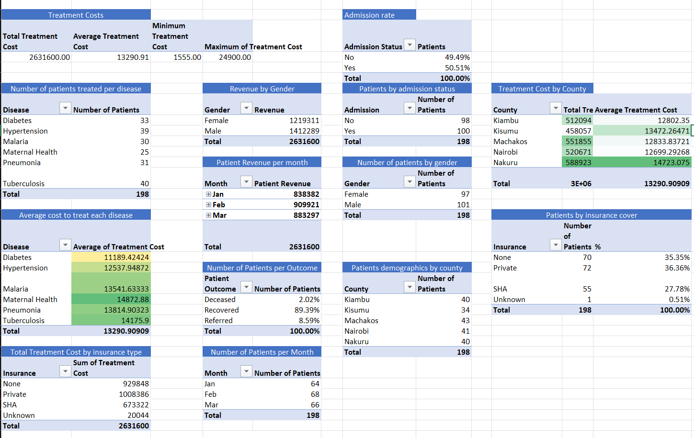

# County Health Analysis: Diseases, Treatment Costs & Patient Outcomes Across 5 Kenyan Counties

## Executive Summary

This project analyzes 198 patient visit records across five Kenyan counties (Nairobi, Kiambu, Kisumu, Nakuru, Machakos) to understand underlying diseases, treatment costs, insurance coverage, and patient outcomes. The dataset spans January–March 2026 and covers six conditions: Tuberculosis, Hypertension, Diabetes, Pneumonia, Malaria, and Maternal Health.

**Key findings:**
- Tuberculosis (40 cases) and Hypertension (39 cases) are the two highest-burden conditions, together accounting for 40% of all visits.
- Overall recovery rate is 89%, with Tuberculosis carrying the highest mortality rate at 5% (2 of 40 cases).
- Nakuru has the highest average treatment cost (KES 14,723) while Nairobi has the lowest (KES 12,699) making a 16% difference.
- Maternal Health has the highest average treatment cost per disease (KES 14,873), while Diabetes has the lowest (KES 11,189).
- Admission rate is nearly split: 50.5% admitted, 49.5% not admitted.
- Over a third of records (36%) have no insurance status recorded, representing the largest data gap in the dataset.
- Data quality issues like male "Maternal Health" cases indicate this dataset should be treated as a **simulated/practice dataset**, not real clinical records. Findings below describe patterns *within this dataset*, not verified clinical conclusions.

## Methodology

**1. Data Cleaning & Quality Assessment**
- Checked for missing values, duplicate records, and inconsistent categorical entries.
- Removed a row where age was 150 because it was a clear outlier.
- Standardized date column into appropriate format and data type.
- Identified a duplicate Patient_ID) assigned to two different visit records. Flagged rather than silently dropped, since both rows contained distinct, plausible data.
- Flagged male "Maternal Health" cases as errors instead of changing them, so as not to make the data look better than it actually is.

**2. Exploratory & Descriptive Analysis**
**Tools used:** Microsoft Excel (PivotTables, PivotCharts, Power Query)

### Treatment Cost
- Total treatment cost across all patients: **KES 2,631,600**
- Overall average: **KES 13,291** (range: KES 1,555 – 24,900)

- Highest average cost by county: **Nakuru (KES 14,723)**
- Lowest average cost by county: **Nairobi (KES 12,699)**

- Highest average cost by disease: **Maternal Health (KES 14,873)**
- Lowest average cost by disease: **Diabetes (KES 11,189)**
  

### Patient Demographics
- **Total patients:** 198 (101 male, 97 female)
- **County distribution:** Kiambu (40), Kisumu (34), Machakos (43), Nairobi (41), Nakuru (40)
- **Monthly volume:** Jan (64), Feb (68), Mar (66): stable, no strong seasonal signal

### Outcomes
- **89% Recovered** (177 patients)
- **9% Referred** (17 patients)
- **2% Deceased** (4 patients total)
- Tuberculosis has the highest mortality rate among all six diseases (5%, 2 of 40 cases)
- Admission rate: **50.5% admitted**, 49.5% not admitted
- Hypertension patients admitted most often (62%), Maternal Health cases least often (32%)

### Insurance Coverage
- **Insurance distribution:** None (70), Private (72), SHA (55), Unknown (1)
- Privately insured patients have the highest total treatment cost (KES 1,008,386) vs. SHA-covered patients (KES 673,322)
- 36% of records (70 patients) had no insurance status recorded
- Unknown insurance may include cash-paying patients, but the dataset lacks a payment-method field to confirm

## Recommendations

1. Strengthen data validation at collection. Cross-field checks (e.g., Disease vs. Gender logic) would catch entry errors before they reach analysis.
2. Fix how missing data is recorded so we do not miss any gaps, especially for people without insurance.
3. Check if Nakuru's higher prices are due to sicker patients or high hospital fees, or if the data is just wrong.
4. Fix how insurance is recorded at the start to accurately analyze how different coverage plans affect health care costs.
5. Put more resources into managing Tuberculosis because it has the most patients and the highest death rate
   
## Next Steps
- If applied to real data, Double-check the data against real hospital records before drawing operational conclusions.
- Explore age-group segmentation (pediatric / adult / elderly) against disease and outcome for a more granular view.
- Investigate why admission rates vary so widely by disease—Hypertension (62%) vs. Maternal Health (32%).

## Data Note
Several data quality issues (detailed above) indicate this is not a verified real-world clinical dataset. Analysis and recommendations should be read as a demonstration of methodology, not as public health findings.

