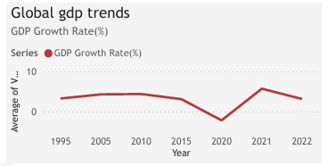
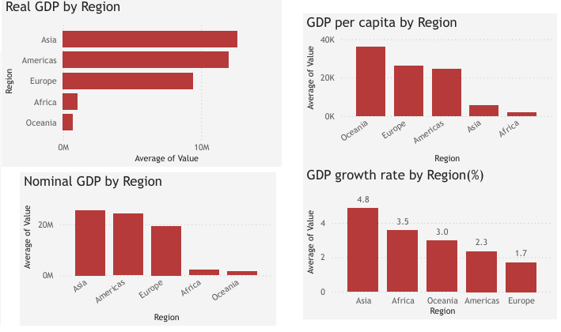
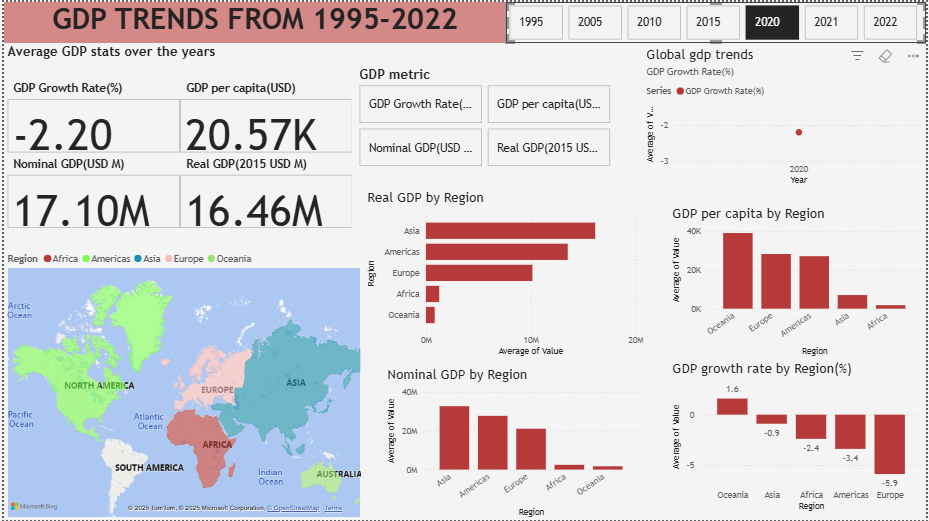
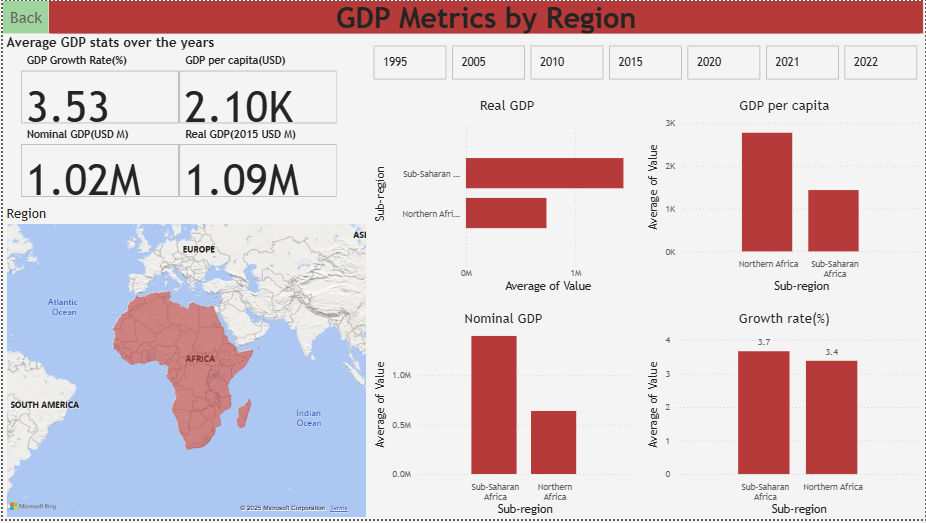
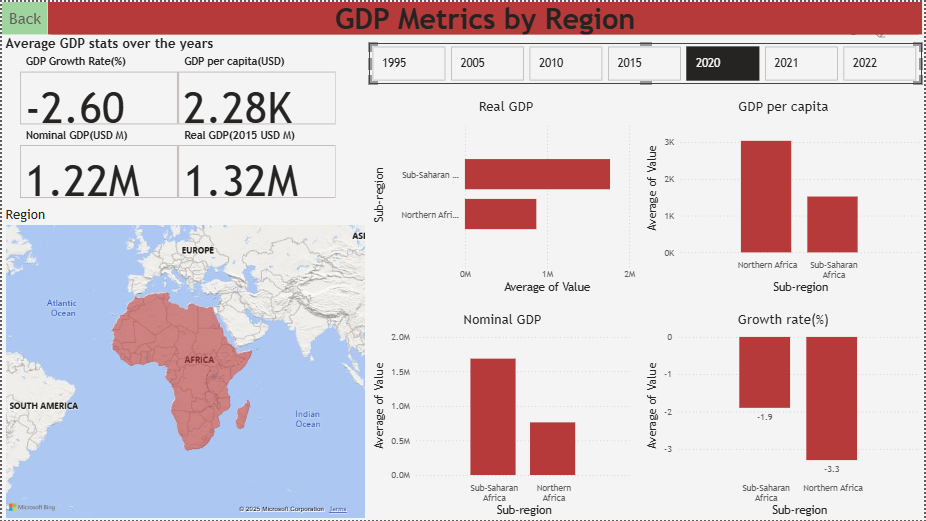
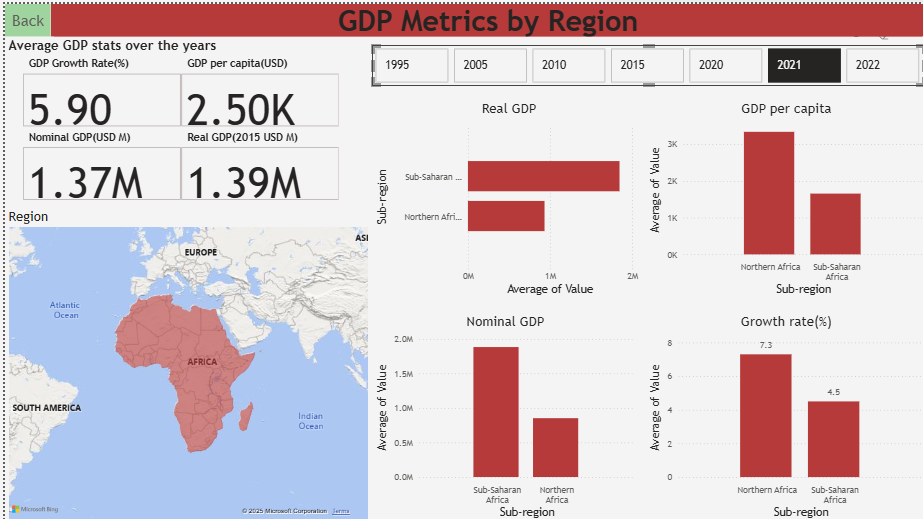
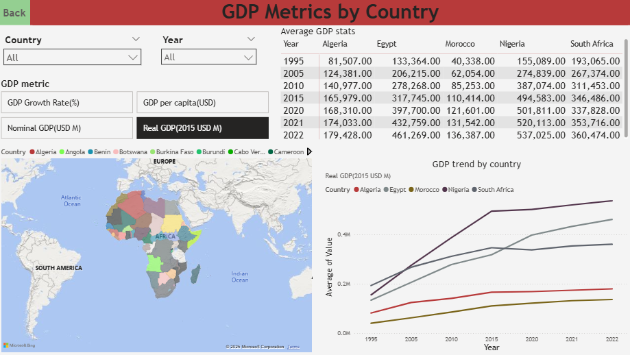

# 🌍 Global GDP Trends Analysis (1995–2022)

This project explores trends in GDP metrics across countries, regions, subregions, and continents from 1995 to 2022 using UN economic data. The dashboard was built in **Power BI**, with data preparation and modeling done in **Excel** and **MySQL**. It focuses on key indicators including real and nominal GDP, GDP per capita, and GDP growth rates.

---

## 📈 Key Insights

### 🌐 Global Overview
The charts below show the global average stats in each metric between 1995-2022:

GDP growth rate overtime
  

- **Asia** leads in **average real and nominal GDP**, with an **average growth rate of 4.8%**, driven by strong export-based economies like **China**, **India**, and **Japan**.
- **Oceania** has the **highest GDP per capita** across the years, while **Africa** ranks lowest.
- - Africa consistently ranks lowest in **GDP per capita**, largely due to high population growth, reliance on agriculture, and low industrial diversification.
  

- **Oceania** recorded a **GDP growth rate of +1.6% in 2020**, while most other regions experienced negative growth due to the COVID-19 pandemic.

- The **global average GDP growth rate** dropped to **2.2% in 2020**, but bounced back to **5.9% in 2021** post-pandemic.
  

### 🌍 Africa Regional Focus

- Africa has had a **steady increase in real GDP**, with an **average growth rate of 3.53%**, second only to Asia.
  
- It experienced a **-2.4% growth rate in 2020**, but recovered to **5.4% in 2021**.
  
- 
- **Sub-Saharan Africa** leads slightly with an average growth rate of **3.6%** from 1995 to 2022, thanks to resource-rich countries and emerging markets.
- **North Africa** surpassed Sub Saharan Africa in **2021 by 2.8%**, likely due to tourism rebound and improved political stability in key countries.
  
- **North Africa** leads in **GDP per capita**, given its relatively smaller population sizes and better economic diversity.

---

### Country-Level Insights

#### 🚀 Top Annual GDP Growth Performers:
- 1995 – **Mali**: 37.2%
- 2005 – **Angola**: 15%
- 2010 – **Uganda**: 19.9%
- 2015 – **Somalia**: 23.7%
- 2020 – **Burkina Faso**: 13%
- 2021 – **Libya**: 28.3% *(oil recovery post-conflict)*
- 2022 – **Cabo Verde**: 17.7% *(tourism and remittances)*

#### 🌟 2022 Standouts:
- **Nigeria** leads in **real GDP**.
- **Seychelles** tops in **GDP per capita**

---

## 🛠️ Tools Used
- **SQL (MySQL)** and **Excel** for data cleaning and relational modeling.
- **Power BI** for creating dynamic, interactive dashboards.
- **UN Data** as the primary source for economic indicators.

---
To get a full view of my work, please click . Do ensure you have power bi application to view.
## 📊 Dashboard Features
- Clickable visualizations to drill down from **continent → region → country**.
- **Slicers** allow targeted analysis by country, year, or metric.
- **Dynamic titles** and interactive buttons for intuitive storytelling.

---

## 📌 Future Enhancements
- Add more economic indicators: population, inflation, trade balance.
- Enable forecasting and trend analysis.
- Investigate causality and economic drivers behind GDP changes.

