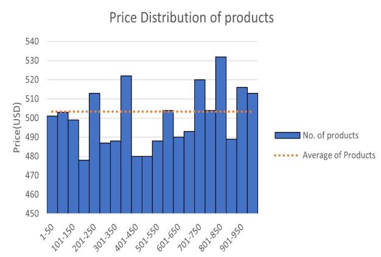
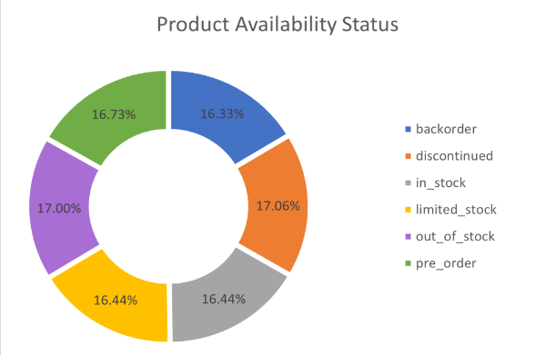
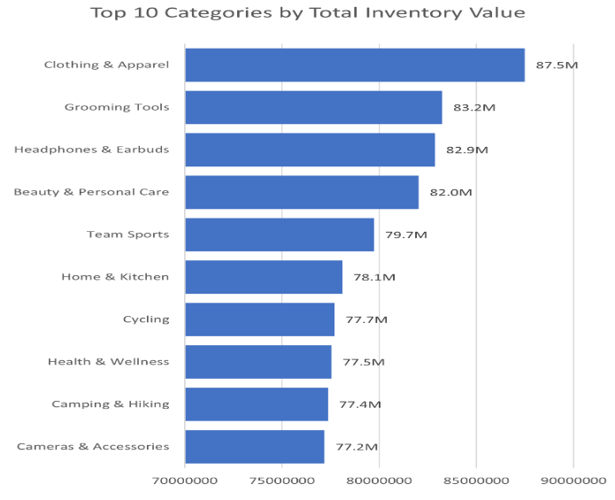
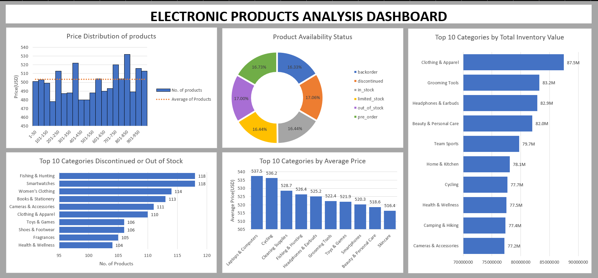

# Electronic Products Analysis: An Exploratory Data Analysis

## Executive Summary
This project explores a 10,000-row e-commerce catalog of electronics and lifestyle products, covering 34 categories such as laptops, smartwatches, fitness equipment, and clothing. Using Excel, I investigated three questions: how are product prices distributed, what does the stock inventory actually look like, and which categories hold the most inventory value. The analysis found that prices are spread evenly across the catalog rather than clustered, that a full third of listed products are currently unavailable, and that everyday lifestyle categories — not tech products — hold the most total inventory value.

## Business Problem / Objective
Before a retail or e-commerce business can make decisions about pricing, restocking, or which categories to invest in, it first needs a clear, accurate picture of what its catalog actually looks like. This project set out to build that picture: understanding how products are priced, how much stock is actually available versus unavailable, and where the most inventory value is concentrated.

## Methodology
1. Clean and prepare the raw product data in Excel.
2. Use pivot tables and formulas to break down price, stock status, and inventory value by category.
3. Summarize the findings into charts and a set of presentation slides.

## Skills
**Excel:** Pivot tables, formulas, data aggregation, chart building

**PowerPoint:** Structuring and presenting data findings visually

## Key Findings

**1. Prices are spread evenly across the catalog, not concentrated at any particular point.**

Prices range from $1 to $999, with a mean of $503 and median of $506 — both close together, which points to an even spread rather than prices clustering at certain price points. Laptops & Computers had the highest average price ($537), but even the gap between the highest and lowest average-priced categories was only $62, meaning no category stands out dramatically from the rest on price alone.

**2. A third of the catalog isn't actually available to buy.**

Stock status is split fairly evenly across six categories (backorder, discontinued, in stock, limited stock, out of stock, pre-order), each sitting around 16–17% of listings. Put together, 34% of all products are either out of stock or discontinued — a meaningful chunk of the catalog that isn't sellable right now. Fishing & Hunting and Smartwatches were the most affected, each with 118 unavailable listings.

**3. The most valuable inventory isn't the tech products — it's everyday lifestyle categories.**

Clothing & Apparel holds the highest total inventory value at $87.5M, ahead of every tech category, despite not having a particularly high average price. The top 10 categories by value total $803M combined, and the average inventory value across all 34 categories is $25M.

## Insights, Limitations & Assumptions

**Insights**
- The catalog is broad — 34 categories, each holding roughly 260–320 products — with prices spread uniformly from $1 to $999.
- 34.1% of listings are unavailable, with Smartwatches and Fishing & Hunting the most affected categories.
- Clothing & Apparel leads on total inventory value, outperforming every tech category despite lower average prices.

**Limitations & Assumptions**
- The uniform price and category distribution is unusual and likely doesn't reflect real-world market behavior.
- Product descriptions carry no real context, so deeper analysis like sentiment analysis wasn't possible.
- There are no date fields in the data, which rules out any trend or time-based analysis.
- Brand-level analysis wasn't reliable, since 9,241 distinct brand names appear across 10,000 products — most brands show up only once.
- The dataset's internal ID field wasn't reliable either, with only 99 unique values across 10,000 rows, so the EAN code was used as the only trustworthy unique identifier.

## Next Steps
If this project continued, the natural next phase would be:
- Testing this same analysis against a real-world, non-uniform dataset to see whether the findings (e.g. lifestyle categories outperforming tech on inventory value) still hold
- Adding date fields to a future dataset to enable trend and seasonality analysis
- Investigating the 34% unavailable inventory further to understand *why* products go out of stock or get discontinued, rather than just how much

## Dashboard

View the [Interactive Dashboard](https://docs.google.com/spreadsheets/d/1zkZeoebZ_qmq8S4wVrcSS0pf5PLAVQqH/edit?usp=sharing&ouid=111629934103608692324&rtpof=true&sd=true) for full details.
