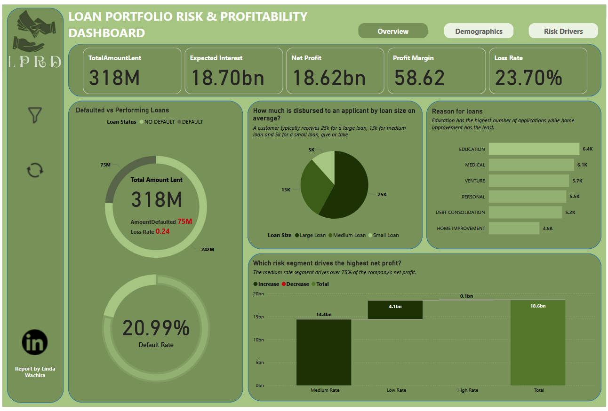
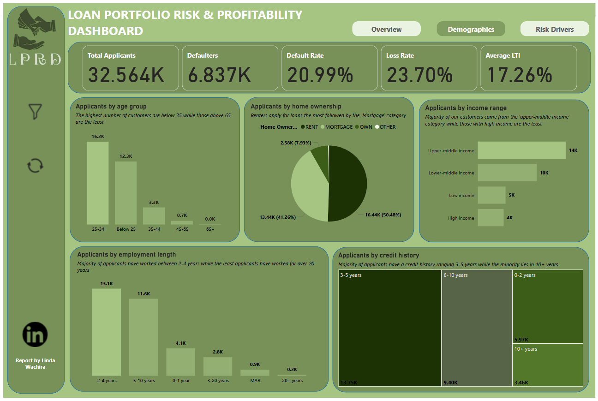
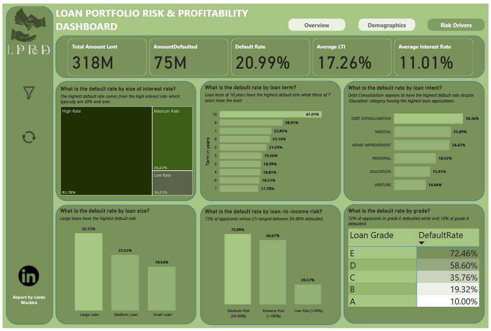

# Loan Portfolio Risk Analytics: Data-Driven Strategies for Loss Prevention

## Overview
This project analyzes a $318M loan portfolio to diagnose the root causes of a high default rate, evaluate the effectiveness of the risk-grading model, and identify strategic opportunities to reduce losses and improve profitability. The goal was to move beyond traditional risk metrics to a profit-aware analysis that informs underwriting strategy and portfolio management.

## Executive Summary
The analysis reveals that the portfolio, while highly profitable overall ($18.62BN Net Profit), is crippled by a 20.99% default rate ($75M lost). The core issue is a misalignment of risk and reward. The riskiest segments (e.g., Grade E) are not the primary drivers of monetary loss. Instead, the largest losses are concentrated in the "Medium Interest Rate" segment—the portfolio's profit engine—which alone contributes $63M (84%) of the defaults. Furthermore, a critical flaw was identified in the risk model, with the "Low Risk" segment accounting for $70M in defaults. Strategic recommendations focus on capping toxic exposures, fortifying the profitable core, and overhauling the risk-pricing model to ensure sustainable growth.

## Stakeholder Questions
1.  Where are we losing the most money?
2.  Is our target market (young borrowers) our biggest problem?
3.  Is our 'Medium Interest Rate' segment our biggest threat?
4.  Why is our 'Low Risk' LTI segment defaulting $70M?
5.  Should we stop lending to Grade E borrowers?
6.  What are the new underwriting rules?

## North Star Metrics and Dimensions
**Key Metrics**
-   Default Rate
-   Loss Rate
-   Net Profit
-   Profit Margin
-   Risk-Adjusted Return

**Dimensions**
-   Loan Grade (A-E)
-   Loan Intent (Debt Consolidation, Education, etc.)
-   Customer Demographics (Age Group, Income, Employment Length, Credit history)
-   Loan Characteristics (Size, Interest Rate, Term)
-   Risk Drivers (Loan-to-Income)

### Dashboard
**Overview** **Customer Demographics** **Risk Drivers**

## Analysis & Key Insights

-   **The Risk-Profitability Paradox:** The portfolio's risk and profitability are inverted. The safest loans (Grade A) have the lowest profit margin (45%), while high-risk loans (Grade D) are highly profitable (85% margin). Grade E has a catastrophic 72% default rate but a 105% profit margin, representing a high-risk niche.
-   **Concentrated Losses in the Core:** The "Medium Interest Rate" segment is the portfolio's most significant vulnerability. As the primary profit driver ($14.4BN), it is also the source of 84% of all losses ($63M), indicating a critical concentration risk.
-   **Flawed Risk Model:** The analysis uncovered a fundamental failure in the risk assessment model. Borrowers classified as "Low Risk" based on Loan-to-Income (LTI) have defaulted $70M, signaling that the model is missing key predictive variables.
-   **Monetary Loss vs. Default Rate:** The segments with the highest default rates are not losing the most money. While borrowers under 25 have the highest default rate (22%), the 25-34 age group defaulted the highest total amount ($39M). Similarly, medium-sized loans cause the highest monetary loss ($44M).

## Strategic Recommendations & Implementation

### 1. Where are we losing the most money & Is our 'Medium Interest Rate' segment our biggest threat?
The largest monetary losses are in high-volume, medium-risk segments, not the highest-risk ones. The "Medium Interest Rate" segment is the single biggest threat and opportunity.
-   **Recommendation:** Implement enhanced income verification and debt-burden analysis for applicants in the Medium Interest Rate band and Grades B/C. This protects the profitable core.
-   **Action:** Mandate stricter proof of employment and existing debt checks for these segments.

### 2. Why is our 'Low Risk' LTI segment defaulting $70M?
This indicates a broken component in the credit risk algorithm, causing systematic mispricing of risk across the portfolio.
-   **Recommendation:** Initiate an urgent, top-priority review and recalibration of the credit scoring and LTI model.
-   **Action:** Assemble a cross-functional team to audit the model's input variables and weighting logic.

### 3. Should we stop lending to Grade E borrowers & What are the new underwriting rules?
While Grade E is profitable, its extreme default rate poses unacceptable reputational and concentration risks. Clear, automated rules are needed to halt the worst exposures.
-   **Recommendation:** Implement a new underwriting "Kill List" to immediately decline the most toxic combinations.
-   **Action:** Configure the loan origination system to:
    -   **Decline all applications for Grade E.**
    -   **Require senior-manager approval for all Grade D applications.**
    -   **Decline any application where the LTI is above 50% and the applicant is under 25.**

## Conclusion
This analysis demonstrates that effective portfolio management requires a dual focus on both risk and profitability. The findings shift the strategic narrative from simply "reducing defaults" to "intelligently managing risk for optimal return." By implementing the prescribed recommendations—capping toxic exposures, fortifying the profitable core, and fixing the foundational risk model—the organization can transform its portfolio to be both more profitable and sustainable. The insights derived provide a clear, actionable roadmap to mitigate current losses and build a more resilient lending business for the future.

## Tools Used
- **Microsoft Excel:** Data cleaning and preprocessing
- **Power BI:** Data visualization, dashboard development, and storytelling
- **DAX (Data Analysis Expressions):** Creation of custom measures and KPIs

  View the [Interactive Dashboard](https://app.powerbi.com/links/xY5nedeoRt?ctid=96a40b0f-fcc0-4cb4-bc02-7dabbfbb6a62&pbi_source=linkShare&bookmarkGuid=2f31e86a-daf5-4972-b600-48b7c692247e) for full details.
