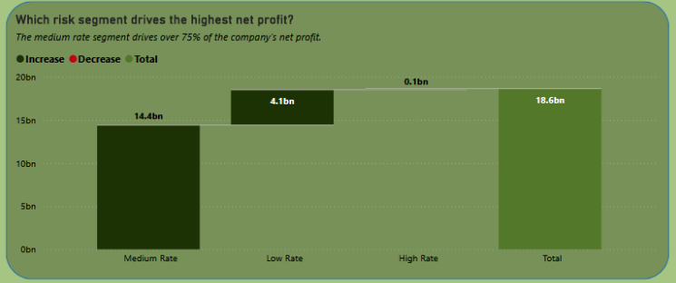
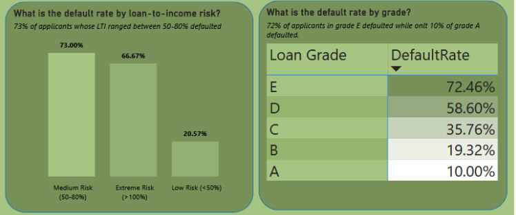
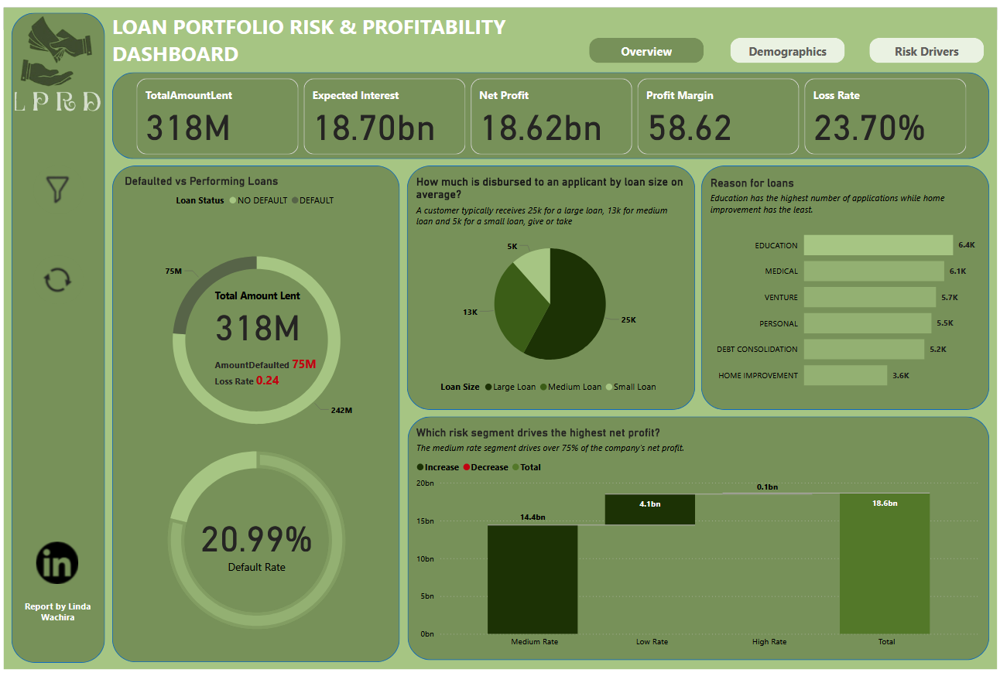
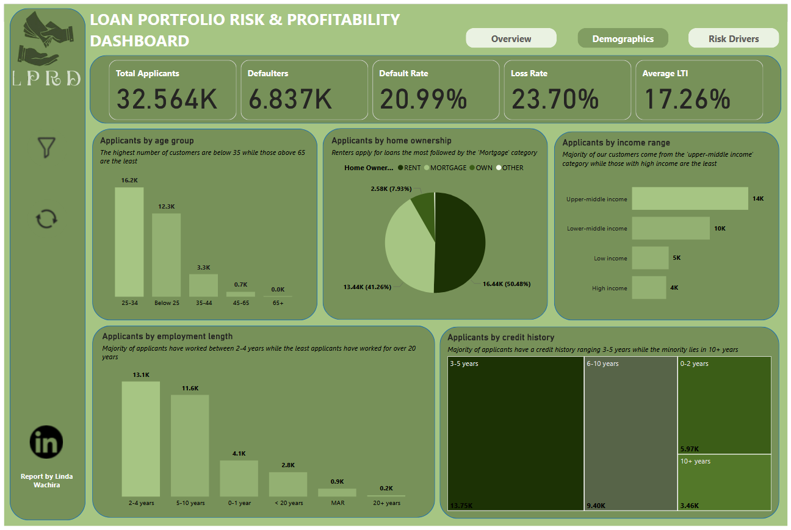
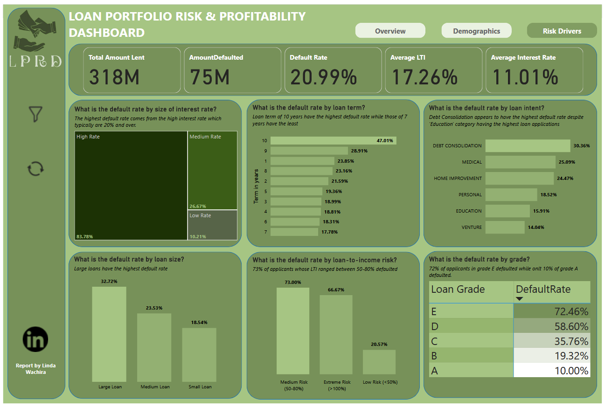

# Loan Portfolio Risk Analytics:
## Executive Summary
Default losses have been high in our loan portfolio, and we needed to determine the root cause and potential solutions. Using Excel, Power BI, and DAX, I cleaned and structured the loan data and built a dashboard to track risk and profitability across every segment of the portfolio. After identifying that the largest losses were hiding inside the portfolio's most profitable segment — not its riskiest one — and that the existing risk-scoring system was misjudging risk on $70M worth of loans, I recommend the following adjustments to reduce losses:

1. Stricter income and debt checks on the portfolio's highest-volume segment
2. A review and rebuild of the risk-scoring model
3. Firm lending limits and senior approval for the highest-risk borrower group

## Business Problem
Lending businesses make money on interest, but lose money when borrowers default. This portfolio was profitable on paper, but leadership needed to know: *where exactly is the money leaking out, and is it coming from the borrowers we'd expect?* Without that answer, any attempt to reduce losses risks cutting off good, profitable lending along with the bad.

## Methodology
1. Clean and structure the loan data in Excel to prepare it for analysis.
2. Build a dashboard in Power BI that tracks risk and profitability across every segment of the portfolio.
3. Write custom DAX measures to calculate default rate, loss amount, and profit margin by segment, and compare them against the existing risk-scoring system.

## Skills
**Excel:** Data cleaning, handling missing values, structuring data for analysis

**Power BI:** DAX, dashboard development, data visualization, data modeling

## Results & Business Recommendations

**1. The biggest losses weren't where they were expected.**

The segment generating the most profit was also responsible for 84% of all default losses ($63M). Meanwhile, the officially "highest risk" loans, while still risky, weren't the main source of financial damage.
→ *Recommendation:* Add stricter income and debt checks specifically for this high-volume segment, since it's both the biggest earner and the biggest risk.

**2. The risk-scoring system had a blind spot.**

Loans that were flagged as "low risk" still lost $70M, meaning the tool used to judge risk was missing something important about which borrowers were likely to default.
→ *Recommendation:* Review and rebuild the risk-scoring model so it's actually predicting defaults accurately, rather than relying on a rule of thumb that's proving unreliable.

**3. A small group of borrowers was extremely risky, but the size of the losses there didn't justify shutting them out entirely.**
A niche group of borrowers had a default rate of over 70%, but they were also highly profitable when they didn't default.
→ *Recommendation:* Rather than cutting this group off completely, apply firm limits and require senior approval before lending to them.

## Next Steps
If this project continued, the next steps I would take would be:
- Monitoring the "highest profits" segment monthly once new checks are in place, to confirm losses actually go down without also cutting into profit
- Expanding the analysis to include a wider time window, to check whether these patterns hold steady or shift with the economy

## Dashboard

**Overview**

**Customer Demographics**

**Risk Drivers**

