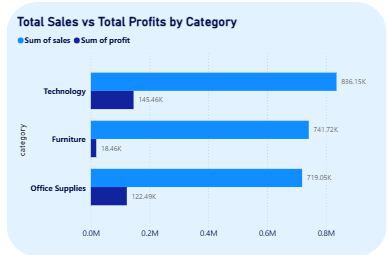
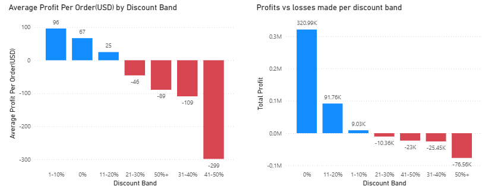
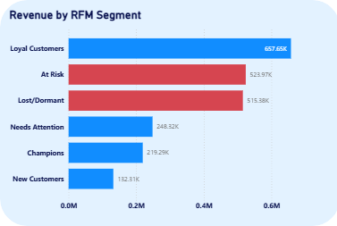
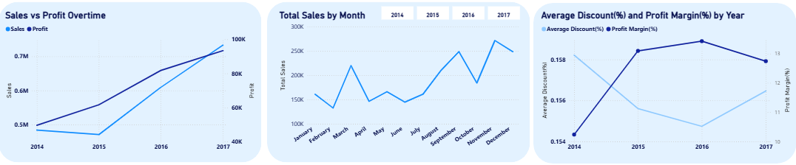

# Sales & Profit Performance Analytics: Northgate Retail Supply Co..

## Executive Summary
Sales had been climbing year over year, but leadership couldn't say with confidence which regions, reps, or products were actually driving profit rather than just revenue. Using MySQL and Power BI, I cleaned and normalized four years of order data and built a dashboard to track sales, profit, and discounting behavior across every region, category, and rep. After finding that one product category was quietly losing money at scale, that discounts past a specific threshold reliably erased profit, and that a third of the customer base — over $1M in historical revenue — was at risk of churn, I recommend the following adjustments:

1. Cap discounts at 20% company-wide, with approval required above that line
2. Reprice or discontinue the two Furniture sub-categories operating at a loss
3. Launch a targeted win-back campaign for at-risk and dormant customers, prioritized by revenue

## Business Problem
Retail businesses grow revenue by selling more, but only make money when what they sell is actually profitable. Northgate's sales had grown steadily for years, but leadership needed to know: *which regions and reps are genuinely profitable, and is our discounting quietly costing us more than it's earning?* Without that answer, the business risked continuing to reward top-line growth that wasn't translating into the bottom line.

## Methodology
1. Clean and normalize the order data in MySQL, resolving duplicate records, inconsistent product identifiers, and formatting issues to prepare it for analysis.
2. Build a dashboard in Power BI that tracks sales, profit, and discount behavior across region, category, sales rep, and customer segment.
3. Write SQL queries to calculate profit margin, discount impact, and customer value (RFM), then bring those results into Power BI to compare them against raw sales performance and find where growth and profitability were diverging.

## Skills
**MySQL:** Query writing, joins, window functions, data cleaning, schema design

**Power BI:** DAX, dashboard development, data visualization, data modeling

## Results & Business Recommendations

**1. Furniture looked like a top seller but it wasn't a top earner.**

Furniture generated $742K in sales but only a 2.5% profit margin, compared to 17%+ for Office Supplies and Technology. Two sub-categories, Tables and Bookcases, were actively losing money.
→ *Recommendation:* Reprice or discontinue Tables and Bookcases, and re-evaluate whether Furniture belongs in future promotional pushes at all.

**2. Discounts past 20% weren't earning loyalty.**

Every discount band above 20% showed negative average profit per order, with the 50%+ tier alone responsible for $76K in losses which was more than every other loss-making band combined.
→ *Recommendation:* Set a firm 20% discount cap, with senior approval required for anything beyond it.

**3. Big risk losing a third of customers**

RFM segmentation showed 396 customers marked "At Risk" or "Lost/Dormant," holding over $1M in total historical revenue.
→ *Recommendation:* Launch a win-back campaign targeting these two segments first, prioritized by past revenue contribution rather than treating all lapsed customers the same.

**4. Growth was coming from more orders, not bigger ones.**

Average order value declined nearly every year, from $499 in 2014 to $435 in 2017, even as total sales rose 51% over the same period.
→ *Recommendation:* Introduce upsell and bundling prompts at checkout to lift order size, rather than relying on order volume alone to drive growth.

## Next Steps
If this project continued, the next steps I would take would be:
- Initiating the 20% discount cap on one region first, to confirm losses drop without also suppressing sales volume
- Investigating whether the 2017 margin dip was driven by regional or category mix shifts, rather than discounting alone
- Extending the analysis to shipping lead time and return rate, to check whether slow fulfillment is contributing to lost repeat business
