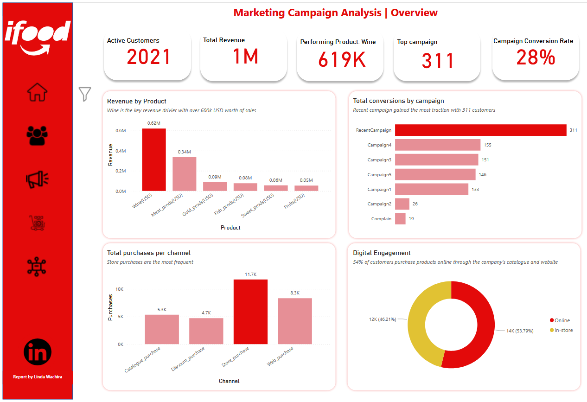
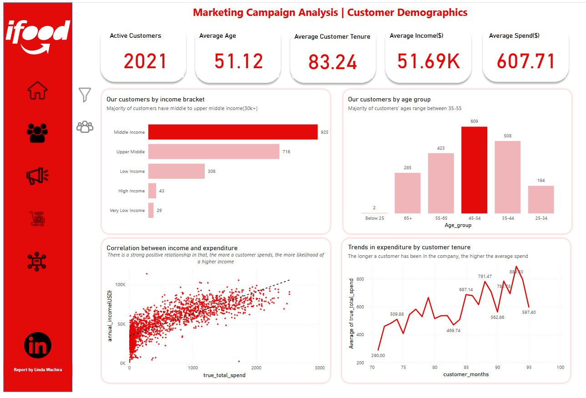
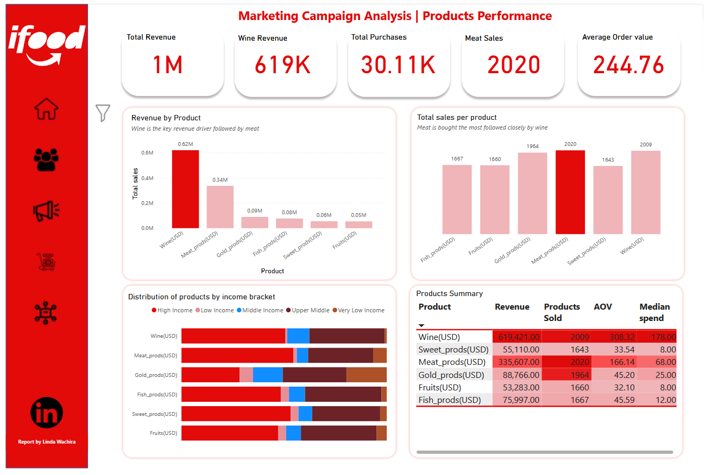
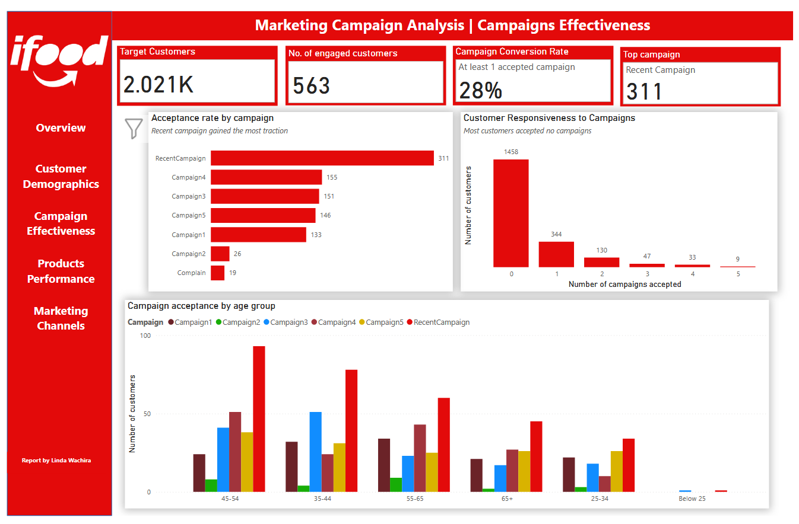

# iFood Marketing Campaign Analysis: Data-Driven Strategies for Growth

## Project Overview
**Company:** iFood (established 2011) - Brazilian online food ordering and delivery platform  
**Objective:** Analyze customer data to evaluate marketing campaign effectiveness, understand purchasing behavior, and identify opportunities to improve ROI and drive growth.

## Executive Summary
Our analysis reveals that iFood's success is powered by a core group of loyal, middle-aged customers with families who spend significantly on **Wine and Meat**. While one recent marketing campaign was a standout success, most campaigns failed to connect with the majority of customers. The biggest opportunity lies in focusing on this valuable core group,keeping them longer and encouraging them to spend more by leveraging what works and fixing what doesn't.

## Stakeholder Questions

### Executives
- Are our marketing campaigns delivering strong ROI?
- Who are our most valuable customers and how do we keep them?

### Marketing team
- Which campaign was most effective and why?
- Why are 72% of customers ignoring our campaigns?
- Which marketing channels are most effective?

### Products team
- Which products are driving our revenue?
- How can we increase average spend per order?

### Channels team
- How does our online platform perform?
- How can we increase website engagement and conversion?

## North Star Metrics & Key Dimensions

### North Star Metric
**Customer Lifetime Value (LTV)**: because there is direct correlation between customer tenure and spending behavior

### Key Driver Metrics
- **Average Order Value (AOV):** $244.76
- **Purchase Frequency:** 14.90
- **Campaign Conversion Rate:** 28%

### Business Dimensions
- Customer Demographics (Age, Income, Tenure)
- Product Categories (Wine, Meat, Gold, etc.)
- Marketing Channels (Store, Web, Catalogue)
- Campaign Performance (Campaign 1-5, Recent Campaign)

## Data Preprocessing

The dataset was a denormalized table containing the following:
- Customer demographics
- Product spending
- Marketing campaign acceptance (Campaigns 1-5, RecentCampaign)
- Channel preferences

### Tools & Process
- **Tool:** MySQL for entire ETL process and Power BI for visualization
- **Process:**
  1. **Data Cleaning:** Handled missing/inconsistent values
  2. **Data Structuring:** Split into normalized tables using **Customer ID** as primary key:
     - Customer Demographics
     - Campaign Acceptance
     - Product Spending
     - Channel Activity
  3. **Data Transformation** Used Power BIs power query editor to transform these tables into workable formats for visualization, and DAX measures for structuring KPIs.

### Dashboard
 
 
## Analysis & Insights

### A. Customer Demographics: Core Buyer Persona
**Insights:**
- Core customer: **35-55 years old, middle-to-upper-middle income**
- Long tenure (avg. 83 months), high average spend ($607.71)
- Mostly family households with children

**Recommendation 1: Launch "Premium Member" Loyalty Program**
- **Implementation:**
  - Tag high-value customers in CRM
  - Offer tiered benefits: free delivery on Wine/Meat, early access, exclusive bundles
  - **Goal:** Increase retention, tenure, and AOV from profitable segment

### B. Product Performance: Revenue Drivers
**Insights:**
- **Wine:** Top revenue driver ($619K, AOV $308)
- **Meat:** Volume leader (2.02K purchases)

**Recommendation 2: Implement Strategic Bundling & Cross-Selling**
- **Implementation:**
  - Create "Perfect Pair" bundles (e.g., "Steak & Cabernet Bundle")
  - Implement personalized prompts: "Customers who bought this also enjoyed..."
  - Feature bundles in digital catalogue and email campaigns

### C. Campaign Effectiveness: Mixed Results
**Insights:**
- **"Recent Campaign":** Major success (311 customers)
- **72% of customers** accepted zero campaigns

**Recommendation 3: Replicate Success & Re-engage Majority**
- **Implementation:**
  - **Scale Success:** Analyze "Recent Campaign" winning elements
  - **Re-engagement:** Shift from sales to value content for non-responders
  - Offer guides, recipes, and exclusive program invitations

### D. Marketing Channels: Purchasing Behavior
**Insights:**
- **In-store:** 54% of purchases
- **Online:** 46% of purchases
- **Catalogue:** Key driver of online sales
- Web purchases peak at 6-8 monthly visits

**Recommendation 4: Refine Digital Channel Strategy**
- **Implementation:**
  - Integrate catalogue with one-click "Add to Cart"
  - Personalize homepage for high-frequency visitors (6+ visits/month)
  - Implement triggered cart abandonment emails

## Limitations & Future Analysis

### Primary Limitation
**Missing date/time column** preventing:
- Seasonal trend analysis
- Customer retention/churn rate calculation
- Campaign performance tracking over time
- Accurate recency analysis

### Recommendation
Ensure future data collection includes timestamps for all transactions and campaign events to enable:
- Time-series analysis
- Seasonal pattern identification
- Dynamic marketing strategy adjustments

## Conclusion
iFood possesses a valuable, loyal customer base. The path to increased ROI lies in maximizing Customer Lifetime Value by focusing on the core segment, leveraging Wine and Meat products, replicating successful marketing tactics, and personalizing the channel experience.

---
**Tools Used:** MySQL, Power BI  
**Dataset Source:** Kaggle iFood Marketing Campaign Dataset
