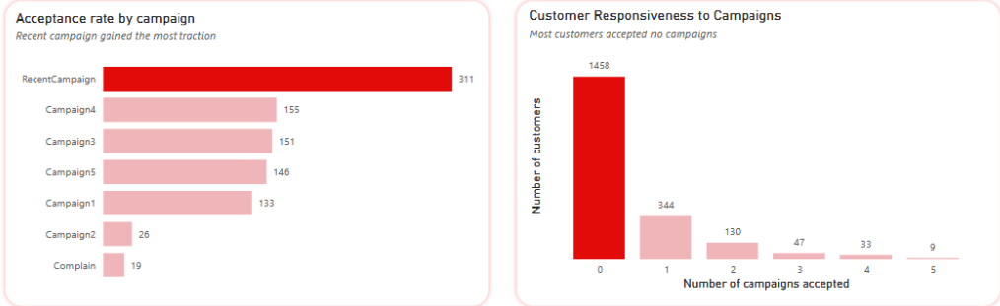
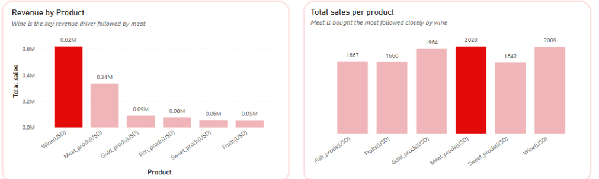
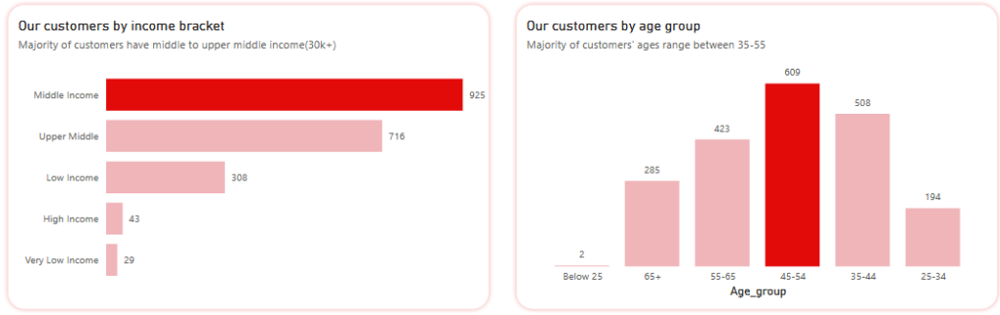
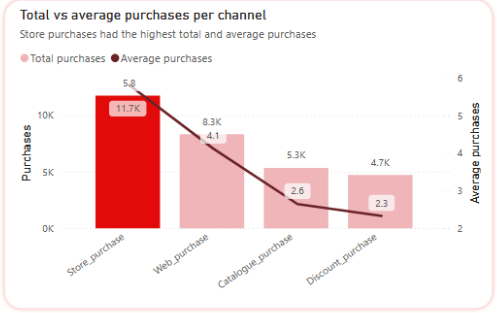
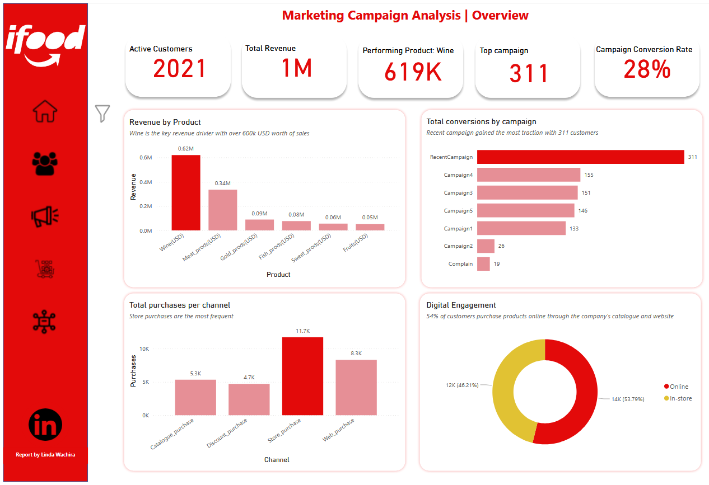
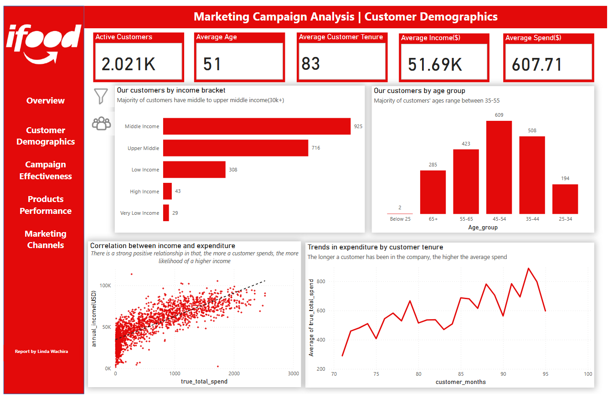
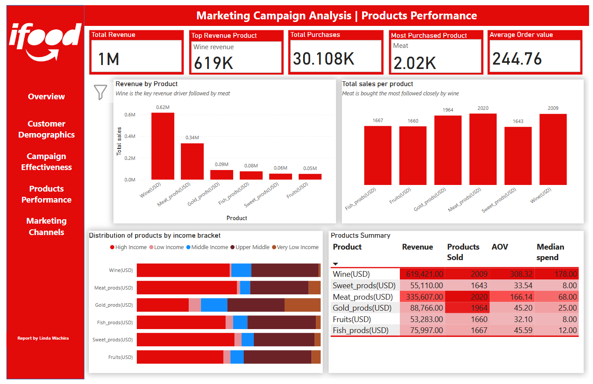
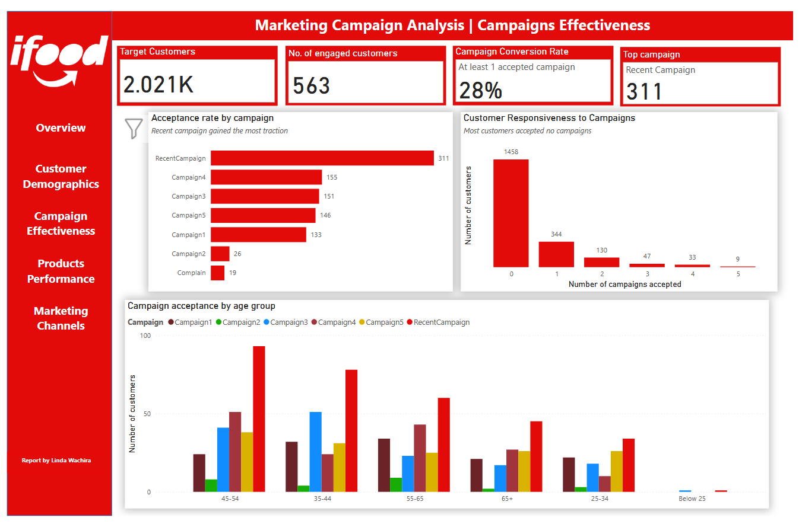
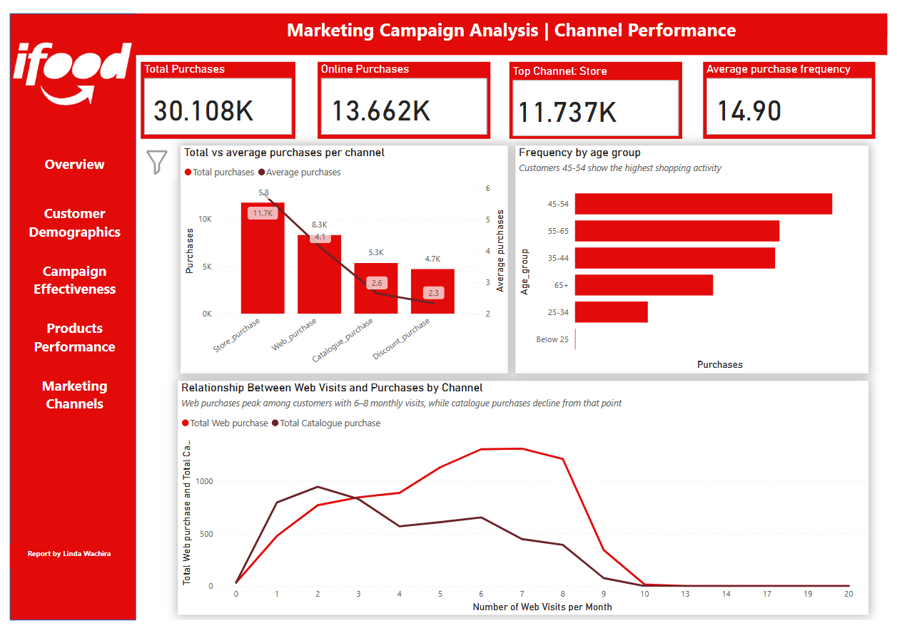

# Marketing Analytics for an Online Food Delivery Platform
 
## Executive Summary
Marketing campaigns had been underperforming, and the business needed to know why growth wasn't matching expectations. Using MySQL and Power BI, I pulled and cleaned customer, product, and campaign data, then built a dashboard to analyze customer behavior, product performance, and campaign results side by side. I found that growth wasn't being held back by a lack of customers — it was being held back by two things: most customers were being ignored by the marketing strategy, and the two best-selling products weren't being used to their full advantage. I recommend the following adjustments to improve results:
 
1. Bundle the two top-performing products together to increase how much each customer spends per order
2. Replace generic campaigns with ones tailored to each customer group's preferences
3. Introduce a loyalty program to build long-term value with existing customers
## Business Problem
A food delivery business generates revenue two ways: bringing in new customers, and getting existing customers to order more, more often. Leadership needed to understand why marketing campaigns weren't converting, which products were actually worth promoting, and whether the current customer base was being used effectively — before spending more on new customer acquisition.
 
## Methodology
1. Write SQL queries to extract and clean customer, product, and campaign data from the database.
2. Build a dashboard in Power BI to explore customer demographics, product performance, campaign results, and sales channels together.
3. Compare campaign performance and product sales across different customer groups to find where the biggest, most fixable gaps were.
## Skills
**MySQL:** Query writing, joins, filtering and aggregating data, data cleaning
 
**Power BI:** DAX, dashboard development, data visualization, data modeling
 
## Results & Business Recommendations
 
**1. Most customers were being missed entirely.**
 

 
72% of customers didn't respond to any marketing campaign. One campaign did work broadly, reaching 311 customers, proving the approach can work, only that it wasn't being applied consistently.
→ *Recommendation:* Roll out that same successful campaign approach to the unresponsive 72%, adjusted with messaging that has worked for each group in the past, rather than treating all customers the same.
 
**2. Two products were driving almost everything, and they weren't being sold together.**
 

 
One product category, wine, brought in the most revenue ($619K), and a second, meat, brought in the highest sales volume — but they were being marketed separately, missing an obvious opportunity to sell more per order. Meanwhile, two other categories were barely selling at all ($55K and $53K).
→ *Recommendation:* Bundle the two top categories together at a compelling price to increase how much customers spend per order, and review whether the weakest categories are worth keeping in current form.
 
**3. The most valuable customers weren't being treated differently.**
 

 
Older cusotmers and higher-income customers spent more per order (over $250 on average) and responded to campaigns at more than double the typical rate — but were getting the same generic treatment as everyone else.
→ *Recommendation:* Give this group early access and exclusive offers, while using more affordable, high-volume bundles to build loyalty with younger or lower-income customers.
 
**4. In-person purchases were still leading, but the platform's online channel had untapped potential.**
 

 
In-store purchases made up the majority of sales (54%), while the platform's online channel was growing but underused, with customer engagement dropping off after 6–8 visits.
→ *Recommendation:* Keep investing in what's already working in-store, while improving the online experience and offering online-exclusive bundles to convert more browsing into buying.
 
## Next Steps
If this project continued, the next steps I would take would be:
- Running a small pilot of the tailored campaign approach on a portion of the unresponsive 72%, to confirm it actually improves conversion before rolling it out fully
- Testing the product bundle in a limited run to measure the actual lift in average order value
- Digging into why online engagement drops off after 6–8 visits, to identify the specific friction point in that experience
## Dashboard
 
**Overview**

 
**Customer Demographics**

 
**Product Performance Analysis**

 
**Campaign Effectiveness Analysis**

 
**Channel Performance Analysis**

 
