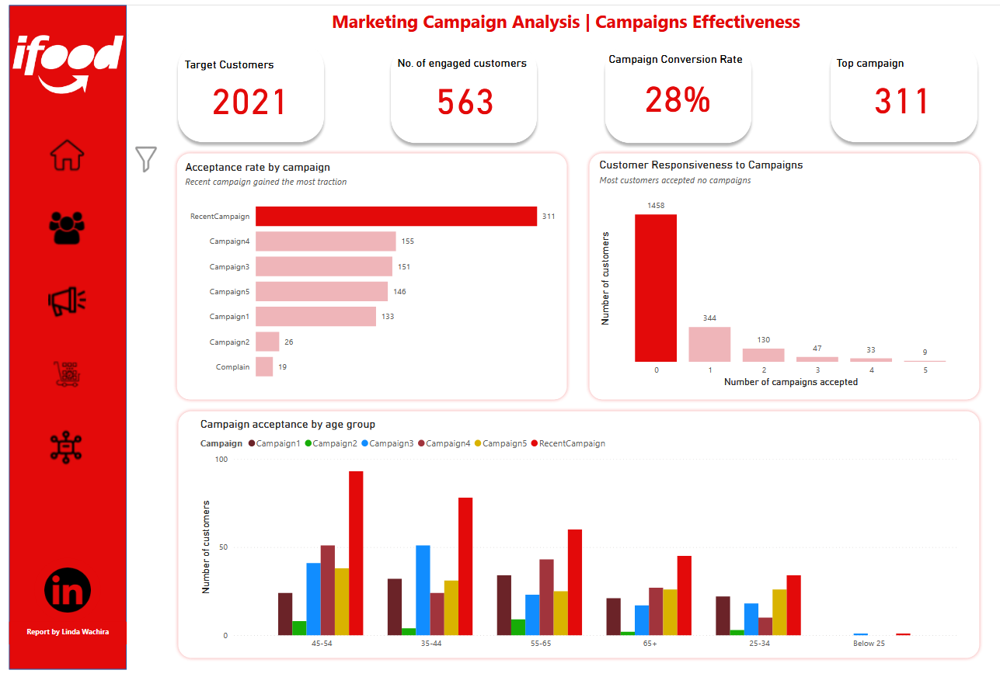

# iFood Marketing Analysis: Data-Driven strategies for growth
## Overview
iFood is a Brazillian online food ordering and delivering platform. This project aims to analyze customer, product and campaign data to evaluate marketing campaign performance, understand purchasing behaviour and identify opportunities to improve ROI and drive the company’s growth.
## Executive Summary
I have identified that the company’s growth is constrained not by lack of customers, but by a failure to leverage the high-value customer base, and inefficiencies in the campaign strategies. The key findings show that a staggering 72% of customers are unresponsive to the marketing campaigns, and the product strategy is not utilizing fully the two powerhouse categories; wine(key revenue driver of $619K) and meat, the volume leader with 2020 in sales. By leveraging strategic product bundling, doing personalized campaigns and implementing a tiered loyalty program, iFood can comprehensively increase the Customer Lifetime Value(LTV), improve the campaign conversion rates and drive sustainable profitable growth.

## Stakeholder Questions
1.	Where should we focus to maximize marketing ROI?
2.	Which products should we promote to increase average spend?
3.	Why do most of our campaigns fail to engage 72% of our customers?
4.	How is our top channel performing and is our digital strategy working?
5.	What do we do with the poor performing products?
## North Star Metrics and Dimensions
**Key Metrics**
-	Revenue
-	Average Order Value(AOV)
-	Conversion rate
-	Frequency
  
**Dimensions**
-	Customer Demographics (Age, Income, Education, Marital Status)
-	Product Categories (Wine, Meat, Gold, etc.)
-	Marketing Channels (Store, Web, Catalogue)
-	Campaign Performance (Campaign 1-5, Recent Campaign)
### Dashboard
**Overview** **Customer Demographics** **Products Performance Analysis**
**Campaigns Effectiveness Analysis** **Channel Performance Analysis**

## Analysis & Key Insights

- **High-Value Customer Profile:** The most profitable customers are aged 35-65, highly educated, and have middle-to-upper-middle income. Customer LTV increases significantly with age and education level. The average tenure is 83 months and an average spend of $608
- **Product Dominance:** Wine and Meat are the undisputed leaders in revenue and volume, respectively, across all major customer segments. Wine drives $619K in revenue and meat has 2020 in volume. The least performing products are sweet products at $55K and fruits at $53K 
- **Campaign Inefficiency:** 72% of customers do not accept any campaigns, representing a massive revenue leakage. Success is possible, as the "Recent Campaign" proved(311 customers traction), but it has to be  systematically replicated.
- **Channel Opportunity:** Online channels have become the primary sales driver, with the web purchases being a key driver but under-optimized asset. This category peaks at 6-8 monthly visits. Store purchases are still leading with 54%(11.7K) in purchases.

## Strategic Recommendations & Implementation
### 1. Where should we focus to maximize marketing ROI?
The highest-value customers are **55+ and highly educated (Masters/PhD)**, with an Average Order Value (AOV) over $250 and campaign conversion rates exceeding 30%. However, 72% of your customer base is unresponsive to campaigns, indicating a major targeting inefficiency.
-	For customers 55+ and with advanced degrees. Offer exclusive products and early access.
-	For the large 35-54 segment. Drive volume with "Wine & Meat" bundles.
-	For younger/low-income segments. Cultivate loyalty with affordable Gold product packs.

### 2. Why do most of our campaigns fail to engage 72% of our customers?
Campaign responsiveness is highly demographic-specific. While the "Recent Campaign" worked broadly, others only resonated with narrow segments (e.g., Campaign 1 with the 65+ group). A generic campaign strategy is failing most of your audience.
-	Target the 72% of non-responders with the "Recent Campaign" offer, but tailored with the creative that historically worked for their demographic.
-	Design new campaigns using each segment's top-performing product as the hero item.

### 3. Which products should we promote to increase average spend?"
**Wine and Meat** are your power duo. Wine is your revenue leader ($619K) and Meat is your volume leader. However, they are being sold in silos, missing a major bundling opportunity to lift the average order value.
-	Creatively bundle Wine and Meat items at a compelling price to systematically increase AOV.
-	Implement prompts online: "Customers who bought this steak also enjoyed this wine."
-	For the poor performing products(sweet products and fruits), a deep-dive profitability analysis should be conducted to determine whether to reallocate the budget to categories like gold products, or to reduce the Stock Keeping Unit(SKU).

### 4. How is our top channel performing and is our digital strategy working?
The store purchase works surprisingly well across all segments. In terms of digital engagement,**the web is the secret weapon**, driving a significant portion of online sales. The catalogue purchases are not far off as well.
-	Keep up the store purchases.
-	Improve on the web user interface and experience as the monthly visits drop upon hitting 8 times.
-	Offer "Online-Only" bundles featured prominently in the catalogue to incentivize digital purchases.

## Conclusion
iFood possesses a valuable, loyal customer base. The path to increased ROI lies in maximizing Customer Lifetime Value by focusing on the core segment, leveraging Wine and Meat products, replicating successful marketing tactics, and personalizing the channel experience.

---
**Tools Used:** MySQL, Power BI  
**Dataset Source:** Kaggle iFood Marketing Campaign Dataset

View the [Interactive Dashboard]([https://app.powerbi.com "Power BI Report](https://app.powerbi.com/links/y66jXWZ08A?ctid=96a40b0f-fcc0-4cb4-bc02-7dabbfbb6a62&pbi_source=linkShare)") for full details.
